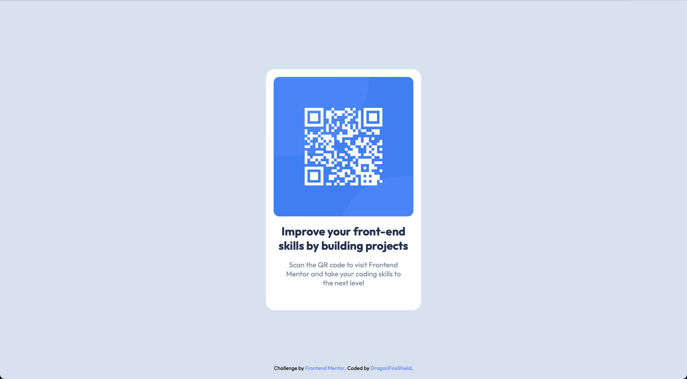

# Frontend Mentor - QR code component solution

This is a solution to the [QR code component challenge on Frontend Mentor](https://www.frontendmentor.io/challenges/qr-code-component-iux_sIO_H). Frontend Mentor challenges help you improve your coding skills by building realistic projects. 

## Table of contents

- [Overview](#overview)
  - [Screenshot](#screenshot)
  - [Links](#links)
- [My process](#my-process)
  - [Built with](#built-with)
  - [What I learned](#what-i-learned)
  - [Continued development](#continued-development)
  - [Useful resources](#useful-resources)
- [Author](#author)

## Overview

### Screenshot

### Links

- Live Site URL: [Github Pages](https://dragonfireshield.github.io/qr-code-component/)

## My process

### Built with

- Semantic HTML5 markup
- CSS custom properties
- Flexbox
- Mobile-first workflow

### What I learned

I’ve implemented some things I learned over the last couple of weeks and before that. Biggest getaway from the past couple of learning sessions is getting a basic grasp of flexbox and understanding absolute positioning and centering an item in the exact middle of its container.

### Continued development

Next step is learning more about flexbox and dipping my toes in grid. I’d also like to add a button for dark mode in the near future. I’ve already been tinkering with the css mix-blend-mode property for this; just need to learn how to toggle things with JavaScript.

### Useful resources

- [Conquering Responsive Layouts](https://courses.kevinpowell.co/conquering-responsive-layouts) - A really nice and well paced introduction to responsive layouts.

## Author

- Frontend Mentor - [@DragonFireShield](https://www.frontendmentor.io/profile/DragonFireShield)
- Twitter - [@shieldfordragon](https://www.twitter.com/shieldfordragon)
